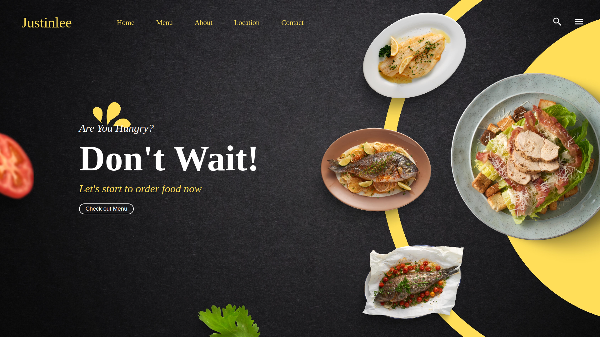
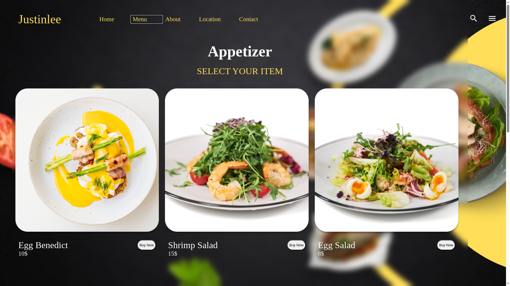
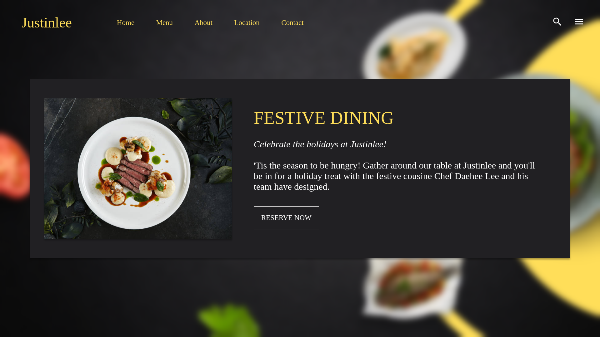

# odin-restaurant-page

###  Time Taken: 6-hr approx.
Part of The Odin Project. Here is the [link](https://www.theodinproject.com/lessons/node-path-javascript-restaurant-page) to TOP project description.

## [LIVE-PREVIEW](https://leedae308.github.io/odin-restaurant-page/)
Here is the screenshot of working website:

<strong> HTML, CSS, JS</strong> project. 100% Custom-codded.

## NEW Skill Tools Used:
JS: npm webpack; creating package.json; src/dist; ES6 class

Works 100% as intended.

### Future Improvments: 
More functionalities.
